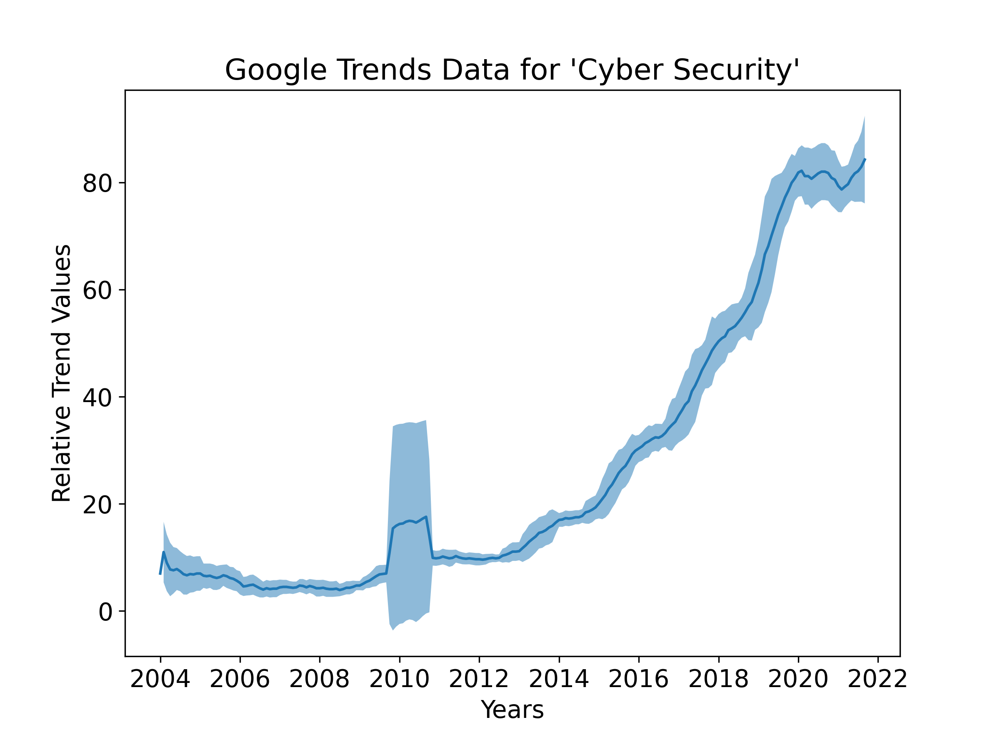
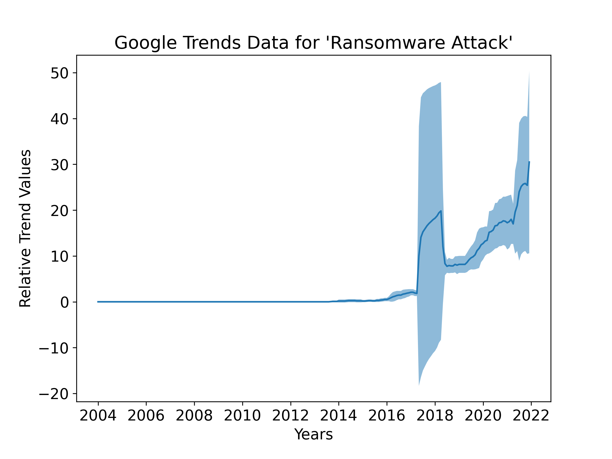
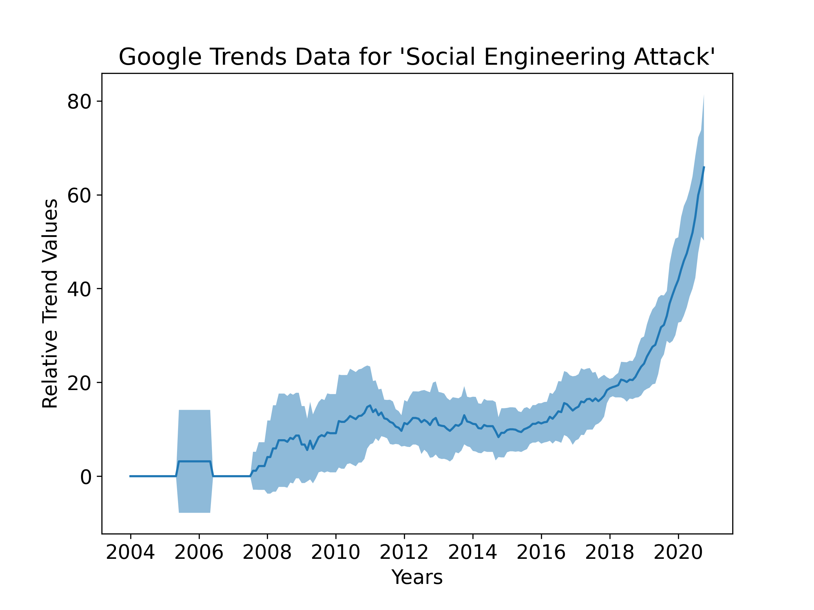

# Graphing Google Trends Data


```python
import pandas as pd
import matplotlib.pyplot as plt
from pandas.plotting import register_matplotlib_converters
register_matplotlib_converters()
```

## Cyber Security


```python
cyber = pd.read_csv("cyber_security.csv", skiprows=2, parse_dates=['Month'], index_col=['Month'])
```


```python
cyber.head()
```


<div>
<style scoped>
    .dataframe tbody tr th:only-of-type {
        vertical-align: middle;
    }

    .dataframe tbody tr th {
        vertical-align: top;
    }

    .dataframe thead th {
        text-align: right;
    }
</style>
<table border="1" class="dataframe">
  <thead>
    <tr style="text-align: right;">
      <th></th>
      <th>cyber security: (Worldwide)</th>
    </tr>
    <tr>
      <th>Month</th>
      <th></th>
    </tr>
  </thead>
  <tbody>
    <tr>
      <th>2004-01-01</th>
      <td>7</td>
    </tr>
    <tr>
      <th>2004-02-01</th>
      <td>15</td>
    </tr>
    <tr>
      <th>2004-03-01</th>
      <td>5</td>
    </tr>
    <tr>
      <th>2004-04-01</th>
      <td>4</td>
    </tr>
    <tr>
      <th>2004-05-01</th>
      <td>7</td>
    </tr>
  </tbody>
</table>
</div>


```python
plt.plot(cyber)
```


    [<matplotlib.lines.Line2D at 0x7fd6809c1a00>]


    

    


```python
y_mean = cyber.rolling('365D').mean()

plt.plot(y_mean)
```


    [<matplotlib.lines.Line2D at 0x7fd691d27eb0>]


    


```python
y_std = cyber.rolling('365D').std()

fig = plt.figure(figsize=(8,6), dpi=300)

plt.rc("font",size=14)

plt.ylabel("Relative Trend Values")
plt.xlabel("Years")
plt.title("Google Trends Data for 'Cyber Security'")

plt.plot(y_mean)

plt.fill_between(y_mean.index,

                 (y_mean - y_std).values.T[0],

                 (y_mean + y_std).values.T[0], alpha=.5)
fig.savefig("cyber.png")
```


    

    


## Ransomware Attack


```python
ransomware = pd.read_csv("ransomware_attack.csv", skiprows=2, parse_dates=['Month'], index_col=['Month'])
```


```python
ransomware.head()
```


<div>
<style scoped>
    .dataframe tbody tr th:only-of-type {
        vertical-align: middle;
    }

    .dataframe tbody tr th {
        vertical-align: top;
    }

    .dataframe thead th {
        text-align: right;
    }
</style>
<table border="1" class="dataframe">
  <thead>
    <tr style="text-align: right;">
      <th></th>
      <th>ransomware attack: (Worldwide)</th>
    </tr>
    <tr>
      <th>Month</th>
      <th></th>
    </tr>
  </thead>
  <tbody>
    <tr>
      <th>2004-01-01</th>
      <td>0.0</td>
    </tr>
    <tr>
      <th>2004-02-01</th>
      <td>0.0</td>
    </tr>
    <tr>
      <th>2004-03-01</th>
      <td>0.0</td>
    </tr>
    <tr>
      <th>2004-04-01</th>
      <td>0.0</td>
    </tr>
    <tr>
      <th>2004-05-01</th>
      <td>0.0</td>
    </tr>
  </tbody>
</table>
</div>


```python
plt.plot(ransomware)
```


    [<matplotlib.lines.Line2D at 0x7fd691b72eb0>]


    
    


```python
y_mean = ransomware.rolling('365D').mean()

plt.plot(y_mean)
```


    [<matplotlib.lines.Line2D at 0x7fd681600b80>]


    
    


```python
y_std = ransomware.rolling('365D').std()

fig = plt.figure(figsize=(8,6), dpi=300)

plt.rc("font",size=14)

plt.ylabel("Relative Trend Values")
plt.xlabel("Years")
plt.title("Google Trends Data for 'Ransomware Attack'")

plt.plot(y_mean)

plt.fill_between(y_mean.index,

                 (y_mean - y_std).values.T[0],

                 (y_mean + y_std).values.T[0], alpha=.5)
fig.savefig("ransomware.png")
```


    

    


## Social Engineering


```python
sea = pd.read_csv("social_engineering_attack.csv", skiprows=2, parse_dates=['Month'], index_col=['Month'])
```


```python
sea.head()
```


<div>
<style scoped>
    .dataframe tbody tr th:only-of-type {
        vertical-align: middle;
    }

    .dataframe tbody tr th {
        vertical-align: top;
    }

    .dataframe thead th {
        text-align: right;
    }
</style>
<table border="1" class="dataframe">
  <thead>
    <tr style="text-align: right;">
      <th></th>
      <th>social engineering attack: (Worldwide)</th>
    </tr>
    <tr>
      <th>Month</th>
      <th></th>
    </tr>
  </thead>
  <tbody>
    <tr>
      <th>2004-01-01</th>
      <td>0</td>
    </tr>
    <tr>
      <th>2004-02-01</th>
      <td>0</td>
    </tr>
    <tr>
      <th>2004-03-01</th>
      <td>0</td>
    </tr>
    <tr>
      <th>2004-04-01</th>
      <td>0</td>
    </tr>
    <tr>
      <th>2004-05-01</th>
      <td>0</td>
    </tr>
  </tbody>
</table>
</div>


```python
plt.plot(sea)
```


    [<matplotlib.lines.Line2D at 0x7fd6703048b0>]


    
    


```python
y_mean = sea.rolling('365D').mean()

plt.plot(y_mean)
```


    [<matplotlib.lines.Line2D at 0x7fd6200433a0>]


    
    


```python
y_std = sea.rolling('365D').std()

fig = plt.figure(figsize=(8,6), dpi=300)

plt.rc("font",size=14)

plt.ylabel("Relative Trend Values")
plt.xlabel("Years")
plt.title("Google Trends Data for 'Social Engineering Attack'")

plt.plot(y_mean)

plt.fill_between(y_mean.index,

                 (y_mean - y_std).values.T[0],

                 (y_mean + y_std).values.T[0], alpha=.5)
fig.savefig("social_engineering.png")
```


    

    


## Phishing


```python
phish = pd.read_csv("phishing.csv", skiprows=2, parse_dates=['Month'], index_col=['Month'])
```


```python
phish.head()
```


<div>
<style scoped>
    .dataframe tbody tr th:only-of-type {
        vertical-align: middle;
    }

    .dataframe tbody tr th {
        vertical-align: top;
    }

    .dataframe thead th {
        text-align: right;
    }
</style>
<table border="1" class="dataframe">
  <thead>
    <tr style="text-align: right;">
      <th></th>
      <th>phishing: (Worldwide)</th>
    </tr>
    <tr>
      <th>Month</th>
      <th></th>
    </tr>
  </thead>
  <tbody>
    <tr>
      <th>2004-01-01</th>
      <td>10</td>
    </tr>
    <tr>
      <th>2004-02-01</th>
      <td>14</td>
    </tr>
    <tr>
      <th>2004-03-01</th>
      <td>12</td>
    </tr>
    <tr>
      <th>2004-04-01</th>
      <td>17</td>
    </tr>
    <tr>
      <th>2004-05-01</th>
      <td>27</td>
    </tr>
  </tbody>
</table>
</div>


```python
plt.plot(phish)
```


    [<matplotlib.lines.Line2D at 0x7fd6817e2a00>]


    
    


```python
y_mean = phish.rolling('365D').mean()

plt.plot(y_mean)
```


    [<matplotlib.lines.Line2D at 0x7fd6702a6e20>]


    
    


```python
y_std = phish.rolling('365D').std()

fig = plt.figure(figsize=(8,6), dpi=300)

plt.rc("font",size=14)

plt.ylabel("Relative Trend Values")
plt.xlabel("Years")
plt.title("Google Trends Data for 'Phishing'")

plt.plot(y_mean)

plt.fill_between(y_mean.index,

                 (y_mean - y_std).values.T[0],

                 (y_mean + y_std).values.T[0], alpha=.5)
fig.savefig("phishing.png")
```


    

    

